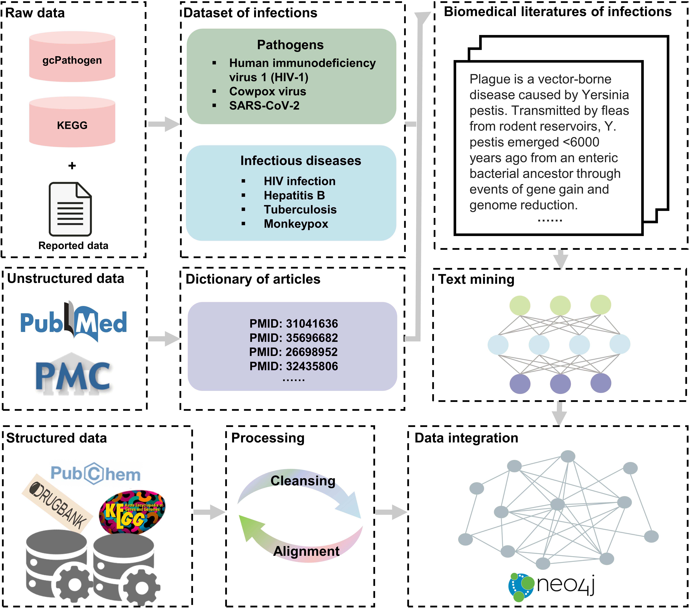

# IDKG: A multidimensional infectious diseases knowledge graph for accelerating drug discovery
[](https://www.python.org)
[](https://pytorch.org)
[](./LICENSE)

## Description

IDKG is a multidimensional knowledge graph for infectious diseases that integrates heterogeneous biomedical data. It has comprised 49,353 nodes across 8 types and 1,231,992 edges of 11 types. Leveraging machine learning techniques, IDKG supports downstream applications such as drug repurposing and similarity analysis to boost anti-infective drug discovery.

## Get start

Clone the repo.

```
git clone git@github.com:henryFan128/IDKG.git
```

Create and activate the enviroment.

```
conda env create -f environment.yml
conda activate IDKG
```

## Downstream tasks
### Drug repurposing 
In the `DrugRepurposing` directory, IDKG can be applied to repurpose drugs based on the data stored in graph databases, such as Neo4j.

```
# train the model
python train.py

# predict/inference
python predict.py
```

### Similarity analysis
In the `SimilarityAnalysis` directory, IDKG can be applied to evaluate the similarity of knowledge of databases.

```
python DisSimilarity.py
```

